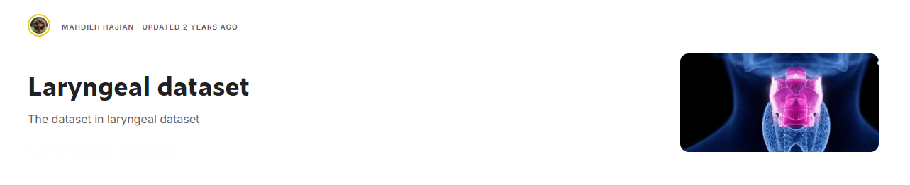

  
  

  <b>
    The dataset in laryngeal dataset.tar contains 1320 patches of healthy and early-stage cancerous laryngeal tissues. The patches (100x100 pixels) were manually extracted from 33 narrow-band laryngoscopic images of 33 different patients affected by laryngeal spinocellular carcinoma (diagnosed after histopathological examination).

"Confident texture-based laryngeal tissue classification for early stage diagnosis support."

The folder laryngeal dataset.tar contains 3 subfolders (FOLD 1, FOLD 2, FOLD 3),
Each subfolder contains 4 folders relative to the four tissue classes, i.e., Le, He, Hbv, IPCL.

Laryngeal cancer is one of the types of throat cancer. This cancer refers to cancer of the voice box, vocal cords and other parts of the throat such as tonsils and oropharynx. Throat cancer is often divided into two categories: throat cancer and larynx cancer. Throat cancer is relatively uncommon compared to other cancers.

Airway protection
The main function of the larynx is to protect the airways from the entry of food particles and other undesirable substances. This action is carried out by a chain of events that starts when a bite of food comes into contact with the tip of the epiglottis or the aryepiglottic fold. The sensory arm of this reflex arch is the lingual pharyngeal nerve and its motor arm is applied through the vagus nerve. The first event in this series is breath control. Then the true vocal cords are tightly closed, which causes the false cords to close. These areepiglottic folds then move medially and pull the epiglottis back (by the laryngeal muscles). At this time, the outer muscles of the suprahyoid group are active and the subhyoid group relaxes at the same time. This event causes a force vector to be applied in the upward and forward direction to the larynx and causes it to go up under the protection of the base of the tongue to the larynx during the act of swallowing.

Voice production
Sound production is another physiological function of the larynx. It is believed that the production of sound is due to the initial strong closure of the vocal cords during exhalation. The rise and fall of the pressure inside the trachea and the opening and closing of the true vocal cords, and as a result, some air is expelled during the period, causes the production of sound. Any pathological process that changes the mass of the vocal cords or their ability to close will affect the quality of the voice. This change in sound quality is called hoarseness.

breathing
The larynx also participates in breathing. At the tail of the recurrent laryngeal nerve, it is activated and causes abrasion of the vocal cords. This happens just before the stimulation of the phrenic nerve and causes air to flow into the lungs.
  </b>

